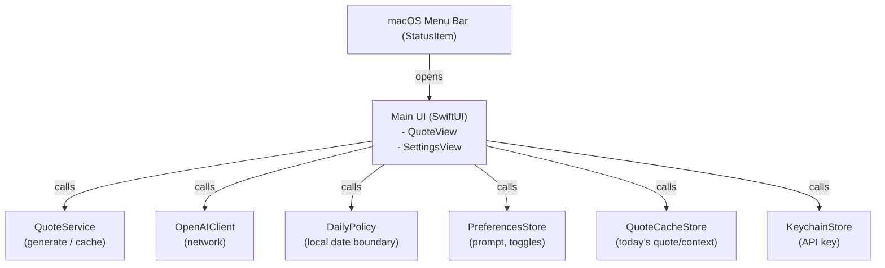

# Wise Companion — Technical Design (MVP)

## 1) Document Control

- **Status**: Draft (MVP)
- **Owners**: (TBD)
- **Last updated**: 2026-01-03
- **Related docs**: `docs/PRD.md`

## 2) Goals & Non-Goals

### Goals (MVP)

- Ship a **macOS menu bar app** that shows a **single daily quote + context**.
- **Auto-launch on login** by default (user can disable).
- User provides their own **OpenAI API key**, stored in **macOS Keychain**.
- Generate **once per local calendar day**; cache locally; deterministic daily re-open.
- Provide **Economy / Premium** toggle with **strict token limits** to control cost.
- Keep UX calm: open → show content (or loading/error) → close.

### Non-Goals (MVP)

- Feeds, history, analytics, social, notifications, journaling.
- Multi-quote/day, background push generation, scheduled notifications.

## 3) High-Level Architecture

### Overview

Wise Companion is a small Swift/SwiftUI app composed of:

- **Menu bar entry** (status item) to open the main content surface
- **Main content surface** (popover or small window) rendering today’s quote
- **Settings** (minimal) for prompt, API key, toggles
- **Services**:
  - Quote generation service (OpenAI client)
  - Persistence (local cache + preferences)
  - Keychain wrapper (API key)
  - “Daily freshness” policy (local calendar day)

### Component diagram (logical)



## 4) Core Flows

### 4.1 App launch (auto-launch default)

**Intent**: Start quietly on login so the ritual is frictionless.

**Mechanism** (preferred): `SMAppService` (Login Item) for modern macOS.

- On first run: enable auto-launch by default (with clear settings toggle to disable).
- If permission prompts or OS behavior requires, handle gracefully and explain in Settings.

### 4.2 “Morning first open” / showing today’s quote

**Decision**: If today’s quote is cached for the current local calendar date **and current mode**, render it immediately. Otherwise, generate, then cache.

Sequence (simplified):

```text
User clicks menu bar icon
  -> QuoteView appears
    -> QuoteService.loadToday()
       -> if cache has entry for local YYYY-MM-DD AND cache.mode == preferences.mode: return it
       -> else: OpenAIClient.generate(prompt, mode)
           -> validate/parse response
           -> persist cache with local YYYY-MM-DD
           -> return new quote
```

### 4.3 Settings flow

Settings must support:

- Prompt text (user-defined)
- Economy/Premium toggle
- Auto-launch toggle
- API key set/update/delete

Settings should never block the main quote view behind modals; opening Settings is user-initiated.

## 5) Data Model & Persistence

### 5.1 Data entities (MVP)

#### QuotePayload

- `dateKey`: String (`YYYY-MM-DD` in local timezone at generation time)
- `quote`: String (1–3 sentences)
- `context`: String (2–4 sentences)
- `createdAt`: Date
- `mode`: Enum (`economy` | `premium`)
- `promptHash`: String (hash of effective prompt inputs; used for debugging/cache invalidation policies)
- `modelId`: String (record what was used)

#### UserPreferences

- `userPrompt`: String
- `mode`: Enum (`economy` | `premium`)
- `autoLaunchEnabled`: Bool

### 5.2 Storage choices

- **Preferences**: `UserDefaults` (or `AppStorage` in SwiftUI) for simple toggles and prompt text.
- **Quote cache**: JSON file in Application Support (or a small Codable blob in `UserDefaults` if size remains tiny).
  - Recommendation: Application Support to keep `UserDefaults` clean.
- **API key**: macOS Keychain only.

### 5.3 “Once per day” policy (local calendar day)

Define:

- `dateKey = Calendar.current.dateComponents(in: .current, from: Date()) -> YYYY-MM-DD`

Behavior:

- If `cache.dateKey == today.dateKey` **and** `cache.mode == preferences.mode`: show cached
- Else: generate new and overwrite cache

Edge cases (accepted in MVP):

- Timezone changes may cause dateKey to shift; simplest approach is to re-evaluate on open.
- Daylight savings is naturally handled by `Calendar`/timezone.

## 6) OpenAI Integration

### 6.1 API surface

Use OpenAI Responses API (or Chat Completions) via HTTPS.

#### Inputs

- System prompt: “wise, calm companion… original-only… avoid clichés”
- User prompt: user-defined prompt string
- Mode: economy/premium determines model + token limits

#### Outputs

- Quote + context in a structured format

### 6.2 Response format contract (for reliable rendering)

Prefer structured output to avoid parsing ambiguity.

Example contract (conceptual):

- Return JSON with keys: `quote`, `context`
- Quote and context are plain strings (no markdown required)

### 6.3 Economy / Premium mode behavior

#### Economy

- Lower-cost “balanced” model configuration
- Lower max output tokens
- Conservative retries (0–1)

#### Premium

- Higher-quality model configuration
- Slightly higher max output tokens (still capped)
- Conservative retries (0–1)

### 6.4 Token and cost controls (hard requirements)

- Set strict **max output tokens** per mode.
- Keep prompts compact (avoid long system instructions).
- Enforce “once/day” generation as the primary cost limiter.
- Do not auto-regenerate repeatedly on transient errors; require user-initiated retry.

### 6.5 Network and error handling

Handle:

- Missing/invalid API key
- No network / timeouts
- API rate limiting / quota exceeded
- Unexpected output shape

UI states:

- Loading spinner / skeleton
- Helpful error copy + “Open Settings” (if key missing) or “Retry”

## 7) Security & Privacy

### 7.1 Key handling

- Store API key only in Keychain.
- Never log the raw key.
- Provide “Remove key” action.

### 7.2 Data minimization

- Store only what is needed locally: prompt text and today’s cached quote/context.
- No analytics/telemetry in MVP.

### 7.3 Logging policy

- Default logging: minimal (errors only).
- Never log prompts/outputs by default (optional dev-only logging gated behind build config).

## 8) Performance Targets

- **Time-to-first-render**: show window/popover within ~1s with cached quote or loading state.
- Quote generation should be cancellable if the view is dismissed.
- Avoid background work unless needed (menu bar idle footprint should be small).

## 9) UI Technical Design (SwiftUI)

### 9.1 Views (suggested)

- `QuoteView`: renders quote/context + footer (date, settings)
- `SettingsView`: prompt editor, API key field, toggles

### 9.2 State management

Simple approach (MVP):

- `AppState` / `QuoteViewModel` as `ObservableObject`
- Dependencies injected (QuoteService, stores)
- Use async/await for generation calls

## 10) Testing Strategy (MVP)

### Unit tests

- DailyPolicy: dateKey generation and “same day” logic
- QuoteCacheStore: read/write/overwrite behavior
- Cache validation: same day but mode change invalidates cache (regenerate / overwrite)
- OpenAIClient: request construction and response parsing (with fixtures/mocks)

### Integration tests (lightweight)

- “No key” path shows correct error and settings affordance
- Cached quote renders without network

## 11) Implementation Notes / Milestones (Suggested)

- Set up macOS menu bar app shell + main window/popover
- Preferences + Settings UI
- Keychain wrapper + API key UX
- Quote cache store + daily policy
- OpenAI client + prompt template + structured output parsing
- Error handling + polish (loading, retry, open settings)

## 12) Open Questions / Follow-ups

- Popover vs window decision (copying text, accessibility, long context handling).
- Exact model IDs for Economy/Premium once we pick OpenAI API flavor for implementation.
- Prompt template finalization and anti-repetition strategy (e.g., include last quote summary hash).
